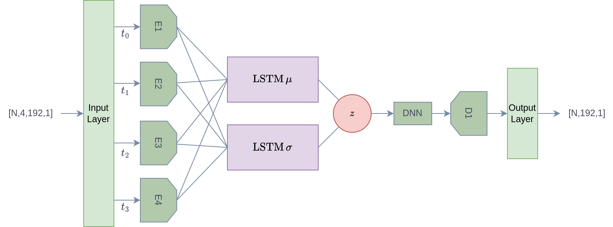
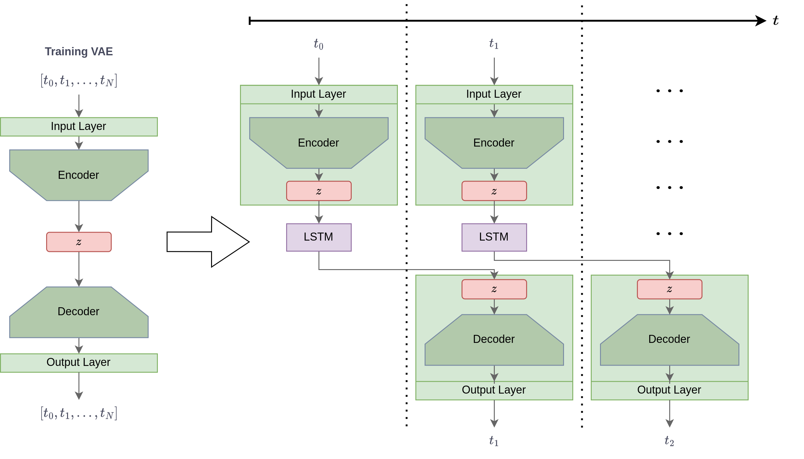
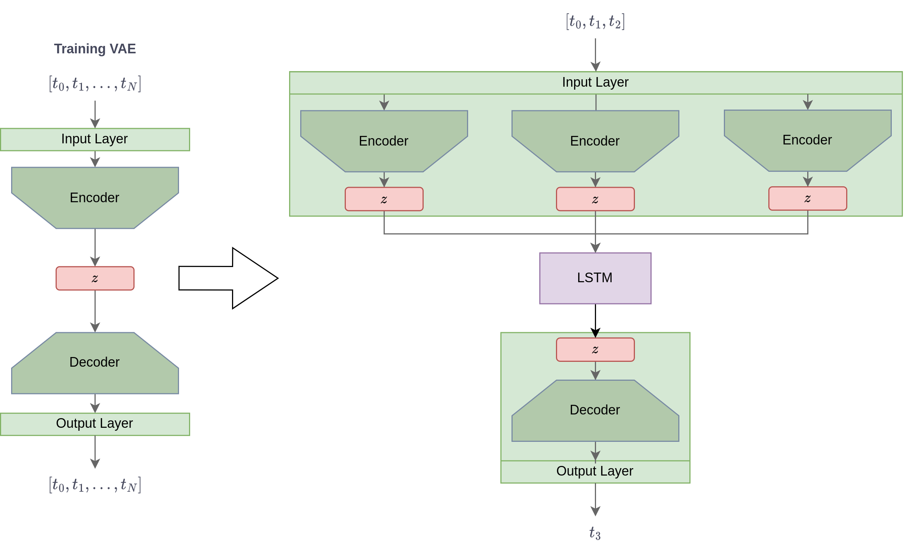

# EIT_trajectory_prediction_VAE-LSTM
Predicting object motion by using a VAE and LSTM.

## Architectures of the VAE-LSTM Models

### V1
If the training is successful, the model should be able to reconstruct voltage data more precisely because a memory is included in the VAE.

- $N$ is the number of training samples
- The memory of the LSTM is $4$ in this case.
- $192$ is the dimension of the voltage vector

### V2 
_based on: [1]_

- The VAE model learns an embedding scheme that can infer the features of the training data.

#### Applied to lung cyclus

### V3

___
[1] Lin, Shuyu, et al. "Anomaly detection for time series using vae-lstm hybrid model." ICASSP 2020-2020 IEEE International Conference on Acoustics, Speech and Signal Processing (ICASSP). Ieee, 2020.
